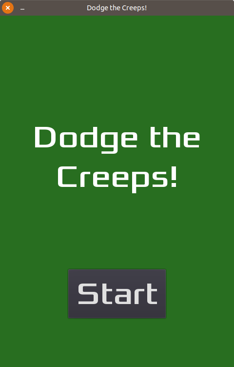
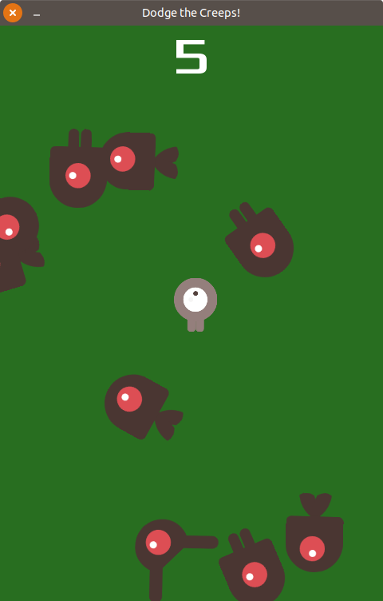

# Dodge the Creeps

## Description

In Dodge the Creeps, the player must move the character to avoid the enemies for as long as possible. Made from the [Your First Game](http://docs.godotengine.org/en/3.0/getting_started/step_by_step/your_first_game.html) tutorial. Original code: https://github.com/kidscancode/Godot3_dodge.

## Preview

	

		
		
		
		
	

## License

This project is licensed under the MIT License - see the [LICENSE](LICENSE) file for details.
